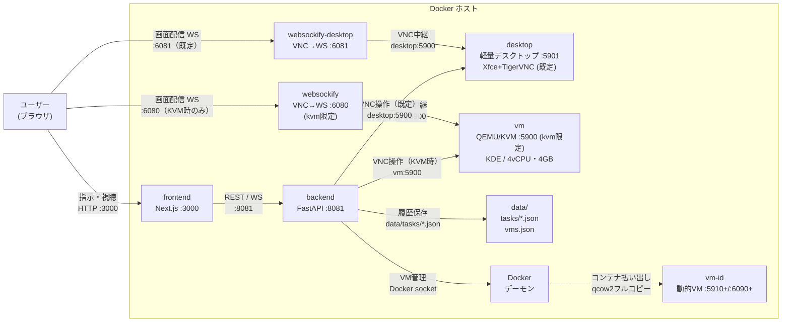

# AI Desktop Agent

自然言語の指示で仮想マシンのGUIをAIが直接操作するデスクトップ作業自動化アプリ。ユーザーはWebブラウザから指示を出し、AIがVMを操作する様子をリアルタイムで視聴できる。

## 概要



ユーザーがWebのチャット画面から自然言語で指示を出すと、AIエージェントがVMのスクリーンショットを取得し、マルチモーダルLLMで状況を判断してマウス・キーボード操作を実行する。その様子は埋め込みnoVNCビューアを通じてリアルタイムで確認できる。

## アーキテクチャ

アプリ全体を **Docker Compose** で完結させる。既定の作業環境は軽量コンテナデスクトップ（`desktop`）で、QEMU VM（`vm`）はKVMがあるホストでのみ起動する。
詳細は [`docs/architecture.md`](docs/architecture.md) を参照。
図は `docs/architecture.md` 内のMermaidブロックが正本である（画像管理はしない）。

| レイヤー | 場所 | 役割 |
|---------|------|------|
| frontend (Next.js) | Dockerコンテナ | チャットUI + noVNCビューア |
| backend (FastAPI) | Dockerコンテナ | 指示受付、エージェント制御 |
| desktop | Dockerコンテナ | 既定の作業環境（Xfce＋VNC `:5901`、QEMU不要） |
| websockify-desktop | Dockerコンテナ | desktop用VNC→WebSocket中継（`:6081`） |
| vm (QEMU/KVM) | Dockerコンテナ（kvm限定） | 重い隔離デスクトップ（KDE）。`/dev/kvm` をマウント |
| websockify | Dockerコンテナ（kvm限定） | vm用VNC→WebSocket中継（`:6080`） |

ブラウザ → `localhost:3000`（frontend）。frontend→backend (`:8081`)、backend→desktop (`desktop:5900`) はDocker内部ネットワークで通信。画面配信は `:6081`（desktop既定、KVM時は `:6080`）。

## 技術スタック

### 仮想マシンとコンテナ実行環境

既定の作業環境は軽量コンテナデスクトップ（`desktop`: Xfce＋TigerVNC、QEMU不要）。
重いQEMU/KVM VM（`vm`: KDE）は `/dev/kvm` があるホストでのみ起動する。

| OS | KVM対応 | 既定動作 | 備考 |
|----|---------|---------|------|
| Linux | ✅ ネイティブ | desktop＋vm | 最速 |
| Windows 11 | ✅ WSL2内で利用可能 | desktop＋vm | WSL2 + Docker Desktop で `/dev/kvm` が使える。BIOSでの仮想化有効化が必要 |
| macOS | ❌ 非対応 | desktopのみ | Docker DesktopのLinux VMがネストKVMをサポートしない。VM起動は制限される |


### Docker によるアプリ配備

アプリ全体を1つの `docker-compose.yml` で完結させる。起動には、KVMを自動判定する `./scripts/up.sh` を使う（`.env` でのKVM指定は不要）。

**動作環境**:

| OS | 要件 | VM動作 | 備考 |
|----|------|--------|------|
| Linux | QEMU + KVM + Docker | desktop＋Docker内KVM | ネイティブ動作、最速 |
| Windows 11 | WSL2 + KVM有効化 + Docker Desktop | desktop＋Docker内KVM | BIOSでの仮想化有効化が必要 |

**KVM自動切替**: `USE_KVM` 未設定時は `auto` として `/dev/kvm` の有無で自動切替する。`./scripts/up.sh` は、KVMがある場合は `--profile kvm` 付きで、ない場合はdesktopのみでcomposeを起動する。TCGソフトウェアエミュレーションでは実用速度が出ないため、KVMがない環境でのVM起動は制限される（APIは409、entrypointは起動拒否）。デバッグ目的で許可する場合は `ALLOW_TCG_VM=true` を設定する。

**デバッグ: VM作り直し**: 操作UIのサイドバー「VM管理（デバッグ）」から `VM作り直し` ボタンでVMコンテナを再起動できる（ゲストOSごとクリーンブート、実行中タスクは停止）。backendがDockerソケット（`/var/run/docker.sock` マウント）経由で操作する。APIを直接呼ぶ場合は: `POST /vm/restart`、`GET /vm/status`。


### LLM / AI モデル

特定のプロバイダに依存せず、**LLMプロバイダ抽象化レイヤー**を設けて複数のAPIに対応する。

| プロバイダ | モデル例 |
|-----------|---------|
| Anthropic | Claude (Computer Use) |
| OpenAI | GPT-4o, GPT-4.1 |
| Google | Gemini |
| ローカル (Ollama) | Llama, Qwen 等 |
| OpenAI互換 (vLLM) | 任意 |
| OpenCode Zen | DeepSeek / GPT / Claude / Gemini 等（`chat/completions`互換モデル） |
| OpenCode Go | 月額制のopenモデル群（`chat/completions`互換モデル。独自UA付き） |

### フロントエンド

- **Next.js** (App Router) を採用
  - チャットUI（指示入力 + 操作ログ表示）
  - noVNC埋め込みビューア（VM画面のリアルタイム視聴）
  - WebSocket接続でバックエンドとリアルタイム通信
  - VM管理パネル（起動/停止/再起動）

### バックエンド

- **FastAPI** + **WebSocket**
  - 指示受付API
  - エージェント制御用WebSocket
  - websockify連携（VNC→WS中継）
  - タスクキュー管理（バックグラウンドジョブ）
  - タスク履歴の永続化（`data/tasks/` にJSON保存、`GET /tasks` で履歴取得。再起動時は中断扱い）

## エージェント設計

単純な「スクショ→LLM→操作→繰り返し」のループでは実際のデスクトップ操作は安定しない。堅牢な動作のために**多段階パイプライン**を採用する。

詳細は [`docs/architecture.md`](docs/architecture.md) を参照。

## プロジェクト構成

```
ai-desktop-agent/
├── pyproject.toml
├── README.md
├── docker-compose.yml       # Docker Compose 構成（desktop/backend/frontend/websockify-desktop＋kvm限定のvm/websockify）
├── docker-compose.override.yml  # ローカル用上書き（任意・git管理外）
├── Dockerfile               # backend コンテナ定義
├── scripts/
│   └── up.sh                # KVM自動判定で compose を起動（.envのKVM指定不要）
├── desktop/                   # 軽量コンテナ実行環境（既定の作業環境）
│   ├── Dockerfile             # Xfce＋TigerVNC＋Firefox＋LibreOffice
│   └── entrypoint.sh          # VNCデスクトップ起動
├── docs/
│   └── architecture.md     # エージェント詳細設計
├── src/
│   └── ai_desktop_agent/
│       ├── main.py              # エントリポイント
│       ├── server/
│       │   ├── app.py           # FastAPIアプリ・REST/WSルート
│       │   ├── session.py       # タスク実行セッション（状態機械の駆動）
│       │   ├── store.py         # タスク履歴の永続化（data/tasks）
│       │   ├── kvm.py           # KVM利用可否判定・VM起動制限（KvmUnavailableError）
│       │   ├── vm_control.py    # VMコンテナ管理（Docker経由の再起動）
│       │   └── vm_pool.py       # 動的VM＋desktop検出（既定desktop優先）
│       ├── agent/
│       │   ├── loop.py          # 状態機械の遷移管理
│       │   ├── state.py         # Goal/Subtask/履歴の定義
│       │   └── llm/
│       │       ├── base.py      # LLMプロバイダ抽象インターフェース
│       │       ├── factory.py   # プロバイダ生成（openai/anthropic/openrouter/opencode/ollama/mock）
│       │       ├── openai_compat_provider.py # OpenAI互換API実装（画像つき判断の中核）
│       │       ├── types.py     # 決定・検証・回復の型定義
│       │       └── mock.py      # テスト用モック
│       ├── vm/
│       │   ├── base.py          # 表示バックエンド抽象化
│       │   ├── vnc_client.py    # VNC接続と制御（vncdotool）
│       │   ├── screenshot.py    # 画面キャプチャ値オブジェクト
│       │   ├── overlay.py       # 座標グリッド重畳・領域ズーム
│       │   └── fake.py          # テスト用フェイク
│       └── actions/
│           ├── primitives.py    # アクション定義・バリデーション
│           └── executor.py      # アクション実行エンジン
├── vm/                          # VMコンテナ用ビルドコンテキスト
│   ├── Dockerfile               # QEMU/KVMコンテナ
│   ├── entrypoint.sh            # QEMU起動スクリプト
│   ├── build-vm-image.sh        # ゲストOSイメージ構築
│   ├── desktop.qcow2            # ゲストディスク（生成物・git管理外）
│   ├── vmlinuz / initrd.img / cmdline.txt  # ゲストカーネル一式（生成物）
├── frontend/                    # Next.js アプリケーション
│   ├── package.json
│   ├── src/
│   │   ├── app/
│   │   │   ├── layout.tsx
│   │   │   ├── page.tsx        # メインダッシュボード（状態復元つき）
│   │   │   └── globals.css
│   │   ├── components/
│   │   │   ├── InstructionInput.tsx  # 指示入力
│   │   │   ├── LogPanel.tsx          # 操作ログ
│   │   │   ├── StatusPanel.tsx       # エージェント状態
│   │   │   ├── ConnectionPanel.tsx   # 接続状態（バックエンド/VNC/VM。右パネル組込）
│   │   │   ├── ControlPanel.tsx      # 一時停止/再開/停止
│   │   │   ├── VMControls.tsx        # VM管理（デバッグ用作り直し）
│   │   │   ├── TaskHistory.tsx       # タスク履歴（日付＋タイトルのみ）
│   │   │   └── VncViewer.tsx         # noVNC埋め込み＋状態表示
│   │   ├── hooks/
│   │   │   └── useWebSocket.ts       # WebSocketクライアント
│   │   └── lib/
│   │       ├── api.ts                # backend APIクライアント
│   │       └── types.ts
├── websockify/                  # VNC→WebSocket中継コンテキスト
└── data/tasks/                      # タスク履歴の保存先（git管理外）
```

## 使い方

### 起動

```bash
cp .env.example .env   # APIキーを設定（KVM指定は不要・自動判定）
./scripts/up.sh
```

* 操作UI: `http://localhost:3000`
* backend: `http://localhost:8081`（`/health`で確認）
* 3000番が他プロセスと競合する場合は `docker-compose.override.yml` でずらす

### 主なAPI

| メソッド | パス | 用途 |
|---|---|---|
| GET | `/health` | 生存確認 |
| POST | `/tasks` | タスク投入（`{"instruction": "..."}`） |
| GET | `/tasks` | 履歴一覧 |
| GET | `/tasks/{id}` | タスク詳細（操作履歴つき） |
| GET | `/tasks/current` | 最新タスク状態（リロード後の復元用） |
| POST | `/tasks/current/{pause,resume,stop}` | タスク制御 |
| GET | `/vms` | VM/コンテナ一覧（既定desktop優先） |
| POST | `/vms` | 環境作成（`{name?, kind?}`。kindはqemu既定/container。非対応環境のqemuは409） |
| GET | `/vm/status` | VMコンテナ状態 |
| POST | `/vm/restart` | VM作り直し（再起動。非対応環境は409） |
| WS | `/ws` | 状態・操作ログのプッシュ配信 |

### 開発

```bash
uv run pytest -q          # backendテスト
uv run ruff check src tests
cd frontend && npm test   # frontendテスト（vitest）
```

## 安全性設計

- **隔離**: AIは隔離環境（VM/コンテナ）内で動作し、ホストに影響を与えない
- **ステップ上限**: 1タスク200アクションで打ち切り（トークン燃費対策）
- **ユーザー割り込み**: Web UIからいつでも一時停止・停止可能
- **操作ログ**: 全アクション＋LLMの判断理由を記録・永続化し、履歴から確認可能
- **画面ブランク対策**: DPMS無効化＋真っ黒検出時の自動ウェイク
- 未実装: アクションレート制限、危険操作のホワイトリスト（予定）

## ロードマップ

- [ ] 定型タスクのテンプレート機能
- [ ] 同時監視グリッド（現状はタブ切替＋単一ビューア）
- [ ] 決定モデル組込み（回復戦略→達成検証→評価ハーネスの順。詳細は `docs/architecture.md`）
- [ ] Android操作モード（検討のみ。詳細は `docs/research/`）

## ライセンス

MIT
