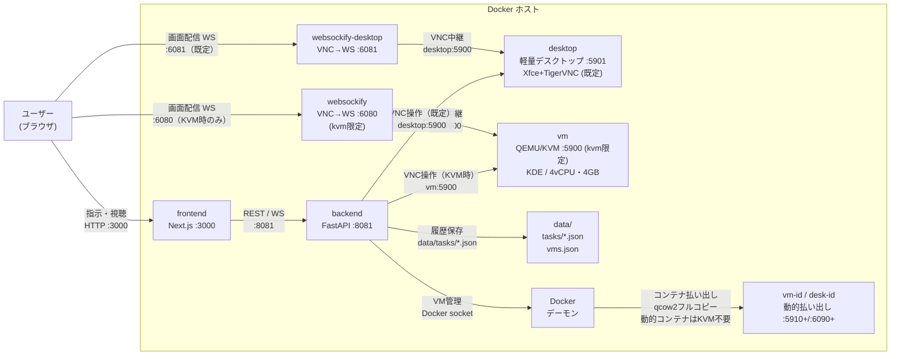
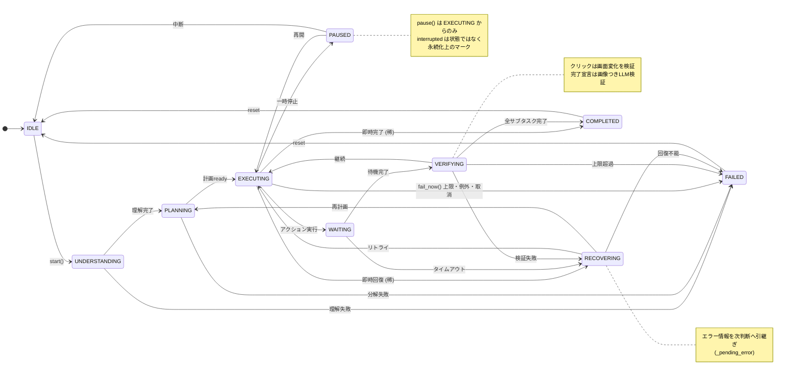
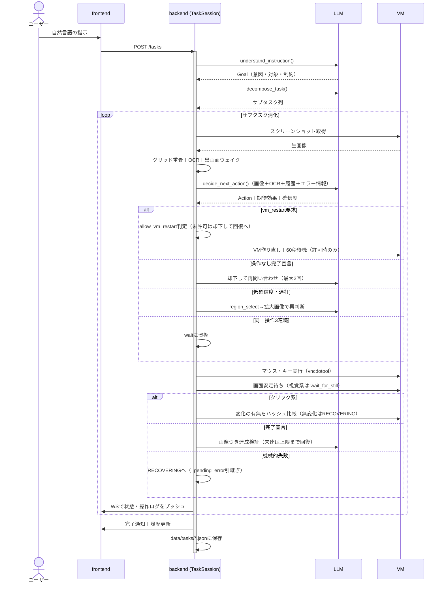
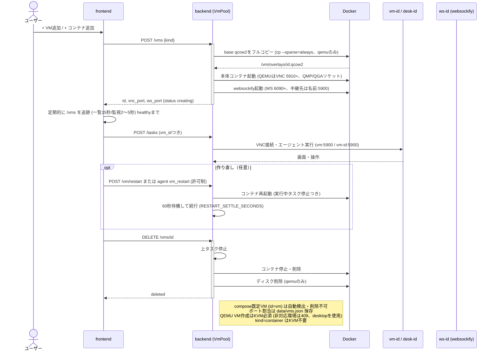

# アーキテクチャ詳細設計

> 本書は実装の実態に合わせた設計書である。コードを読む際の地図として使うこと。
> 主要モジュール: `src/ai_desktop_agent/` 配下（`server/`・`agent/`・`actions/`・`vm/`）、
> `frontend/src/`、`vm/`（ゲストコンテナ定義）。

## 目次

1. [システム概要](#システム概要)
2. [バックエンド（FastAPI）](#バックエンドfastapi)
3. [エージェント状態機械と実行フロー](#エージェント状態機械と実行フロー)
4. [意思決定層（LLM＋決定モデル）](#意思決定層llm決定モデル)
5. [観測（スクリーンショットとその周辺）](#観測スクリーンショットとその周辺)
6. [アクション実行（VNC操作層）](#アクション実行vnc操作層)
7. [VM操作アーキテクチャ](#vm操作アーキテクチャ)
8. [フロントエンド](#フロントエンド)
9. [安全性・運用](#安全性運用)
10. [既知の制限と今後](#既知の制限と今後)
11. [図の管理](#図の管理)

> 図はすべて本文中のMermaidブロックで管理する（別ファイル・画像生成は不要）。
> GitHub・VS CodeのMarkdownプレビューでそのまま表示できる。

## システム概要

自然言語の指示で仮想マシンのGUIをAIが直接操作する。ユーザーはブラウザから指示を出し、
AIがVMを操作する様子をnoVNCビューアでリアルタイム視聴できる。



| コンテナ | 中身 | ポート | 役割 |
|---------|------|--------|------|
| frontend | Next.js | 3000 | チャットUI＋noVNCビューア＋VM管理 |
| backend | FastAPI | 8081 | 指示受付、エージェント実行、タスク永続化 |
| desktop | Xfce＋TigerVNC | 5901 | 既定の作業環境（QEMU不要の軽量デスクトップ） |
| websockify-desktop | VNC→WS中継 | 6081 | desktop向け画面配信 |
| vm | QEMU/KVM | 5900 | 重い隔離デスクトップ（KDE。kvm限定） |
| websockify | VNC→WS中継 | 6080 | vm向け画面配信（kvm限定） |

動的VM（Plan B）は `5910+`（VNC）/`6090+`（WS）を使い、台数分コンテナが増える。
`vm`・`websockify` は `kvm` プロファイル配下のため、`./scripts/up.sh`（KVM自動判定）
または `docker compose --profile kvm up` でのみ起動する。
詳細は [VM操作アーキテクチャ](#vm操作アーキテクチャ) を参照。

| From | To | 経路 |
|------|-----|------|
| ブラウザ | backend API/WS | `:<ホスト>:8081` |
| ブラウザ | 画面配信 | `:<ホスト>:6081`（desktop既定。KVM時は `:<ホスト>:6080`） |
| backend | desktop (VNC) | `desktop:5900`（Docker内部ネットワーク） |
| backend | VM (VNC) | `vm:5900`（KVM時。動的VMは `vm-<id>:5900`） |
| websockify-desktop | desktop (VNC) | 同上 |
| websockify | VM (VNC) | 同上 |
| backend | Docker | `/var/run/docker.sock`（VM作成・再起動用） |

環境変数（代表）：`LLM_PROVIDER` / `LLM_MODEL` / 各種 `*_API_KEY`、`VNC_HOST`（既定`desktop`）/ `VNC_PORT`、
`USE_KVM`（既定`auto`。未設定時は `/dev/kvm` の有無で自動切替）/ `ALLOW_TCG_VM`（既定`false`。TCG明示許可）、
`VM_MEMORY`（既定4096）/ `VM_CPUS`（既定4）、`DATA_DIR`（既定 `./data`）。

## バックエンド（FastAPI）

`src/ai_desktop_agent/server/app.py` がAPIとWebSocketを提供する。

### エンドポイント一覧

| メソッド | パス | 用途 |
|---|---|---|
| GET | `/health` | 生存確認 |
| POST | `/tasks` | タスク投入（`{instruction, vm_id?, allow_vm_restart?}`） |
| GET | `/tasks` | 履歴一覧（新しい順） |
| GET | `/tasks/{id}` | タスク詳細（操作履歴・推論つき） |
| DELETE | `/tasks/{id}` | 履歴削除（実行中なら停止して削除） |
| GET | `/tasks/current` | 最新タスク状態（リロード後の復元用。なければ `idle`） |
| POST | `/tasks/current/{pause,resume,stop}` | タスク制御 |
| GET | `/vms` | VM一覧 |
| POST | `/vms` | VM作成（ディスク複製＋起動） |
| DELETE | `/vms/{id}` | VM削除（上タスク停止＋コンテナ＋ディスク削除） |
| GET | `/vm/status` | 既定VMの状態（Docker＋QMP） |
| POST | `/vm/restart` | 既定VMの作り直し（実行中タスク停止つき） |
| WS | `/ws` | 状態・操作ログのプッシュ配信 |

### セッション管理

- 1タスク＝1 `TaskSession`（`server/session.py`）。`POST /tasks` ごとに生成し、
  `_sessions[session.id]` に登録する。`_active_session` は後方互換のための最新1件。
- セッションは `vm_id` を持ち、指定VMの `VNCClient` に `set_display()` で切り替える。
  `vm_id` 省略時は稼働中の既定VM（`VmPool.default_vm()`）。
- WebSocket配送はグローバルレジストリ（`_ws_state_cbs` 等）経由のファンアウトで、
  全メッセージに `session_id` / `vm_id` を付与する。フロントは選択中のVMで選別する。

### 永続化（`server/store.py`）

- `data/tasks/<task_id>.json` に1タスク1ファイルで保存する。状態遷移・アクション実行のたびにupsert。
- `TaskRecord` は指示・状態・成否・操作履歴（判断理由・確信度つき）・サブタスク・
  進捗index・`vm_id`・トークン使用量（prompt/completion/呼出回数）を持つ。
- 起動時（lifespan）に実行中だった記録を `interrupted` に変える（`mark_interrupted()`）。
- 保存先が書けない環境では一時ディレクトリに退避して動作継続する。

### VM管理

- `server/kvm.py`（KVM判定の正本）：次の順序で判定する（`USE_KVM` 明示値 → backendの `/dev/kvm` →
  Docker上の `vm` サービス存在）。KVMなし環境でのVM作成・再起動は
  `KvmUnavailableError` で拒否する（APIは409。`ALLOW_TCG_VM=true` でのみ明示許可）。
- `server/vm_control.py`（`VmController`）：既定VMの状態取得・再起動。状態にQMPの
  `query-status` 結果（`qmp_status`）を添える。Docker不通時は `DockerUnavailableError`→503。
- `server/vm_pool.py`（`VmPool`）：環境の一覧・作成・再起動・削除＋compose管理の
  `desktop` 検出（id `desktop`、`managed=False`、既定ポート `5901`/`6081`）。
  `default_vm()` はソート順で `desktop` を優先する（両方稼働時はdesktop）。
  `POST /vms` は `kind` で種別を選ぶ（`qemu`＝既定／`container`）。
  qemu作成時はbase qcow2のフルコピーを払い出し（ロック競合回避のためbacking参照は使わない）、
  VNC/WSポートを `5910+`/`6090+` から割当て、ポート割当を `data/vms.json` に保存する。
  container作成時は軽量デスクトップ＋中継の2コンテナを払い出し、KVM不要でどこでも作れる。
  動的VMのidは `vm-<hex>`、動的コンテナは `desk-<hex>`。上限8台（`MAX_VMS`、両種別の合計）。
  動的QEMU VMは `/dev/kvm` を常時要求する（KVM必須）。
  一覧の種別は `kind`（`qemu`／`container`）で返す。`desktop` と既定VM（`vm`）は削除不可。
  ホストパス解決はbackend自身の `/app/data` マウント元から逆算する（`_host_repo_dir()`）。

## エージェント状態機械と実行フロー

### 状態と遷移（`agent/state.py`・`agent/loop.py`）

有限状態機械。`AgentLoop` が有効遷移のみを通す。不正遷移は `InvalidTransitionError`。
有効遷移の正本は `_VALID_TRANSITIONS`（`agent/state.py:29`）である。



状態一覧：`IDLE / UNDERSTANDING / PLANNING / EXECUTING / WAITING / VERIFYING /
RECOVERING / PAUSED / COMPLETED / FAILED`。`PAUSED` 以外の停止系は終端扱い。
`interrupted` は状態機械の状態ではなく、再起動後に付け替える永続化上のマーク。
`pause()` は `EXECUTING` からのみ可能。`fail_now()` は上限・例外・キャンセル時に打ち切るための遷移である。

### TaskSessionの実行フロー（`server/session.py:run()`）



1. **UNDERSTANDING**：`understand_instruction()` で指示→`Goal`（意図・対象アプリ・制約）。
2. **PLANNING**：`decompose_task()` でサブタスク列に分解（ID・説明・期待結果つき）。
3. **EXECUTING→WAITING→VERIFYING** のループ（`_execute_phase()`）：
   - 画面取得（オーバーレイ付き。真っ黒ならShiftキーを送って復帰させ、再取得）
   - 無変化検出：前ターンと同一画面なら「待機か別手段を」のヒントをLLMに渡す
   - アクション決定。操作なし完了宣言は最大2回まで却下して再問い合わせ
     （`MAX_EMPTY_COMPLETE_REFUSALS`、`_is_empty_complete()`）
   - 低確信度クリック・同一座標連打は `region_select` 拡大フローへ迂回
   - 同一アクション3連続は `wait` に置換（足踏みブレーカー）
   - `vm_restart` は専用フロー（後述）
   - 座標クランプ→実行→視覚系操作後は画面安定待ち（`wait_for_still`）
   - ステップ上限200（`MAX_ACTIONS_PER_TASK`）超過で `fail_now()`
4. **VERIFYING**（`_verify_phase()`）：
   - 機械的失敗→RECOVERING（エラー情報を次判断へ引継ぎ）
   - クリック系→画面変化の有無をハッシュ比較（無変化は空振りとしてRECOVERING）
   - `subtask_complete`→期待結果の達成を**画像つきでLLM検証**
     （`_verify_subtask_phase()`）。未達は上限（`max_retries`）まで回復、
     超過で `fail_now()`
5. **RECOVERING**：`recover_from_error()` で回復計画。`recoverable` ならリトライ、
   さもなくば失敗。計画の `strategy` は現状リトライ可否のみに使う。
6. 例外・キャンセル時は必ず `FAILED` に遷移させて保存する（記録なしに終わらせない）。
   一時停止中は遷移前に `_wait_if_paused()` で再開を待つ。

### エージェント判断のVM作り直し（許可制）

- アクション `vm_restart {reason}`（`actions/primitives.py`）。
- タスク投入時の `allow_vm_restart`（UIのチェックボックス）が真の場合のみ実行。
  未許可なら却下して回復フローへ（別手段を促す）。
- 実行後は環境初期化として回復フローに戻し、新画面で再判断する。
  再起動後は `RESTART_SETTLE_SECONDS`（60秒）待ってから続行する。

## 意思決定層（LLM＋決定モデル）

判断は「生成系LLM」と「決定モデル（確定的な分類・判定）」の分担を方針とする。
生成（座標・文章・計画）はLLM、定型判断（成否・戦略選択）は決定モデルに寄せる。

### LLMプロバイダ（`agent/llm/`）

- `factory.py` の `create_llm_provider()` が全プロバイダを `OpenAICompatProvider` に束ねる。
  対応：`openai / anthropic / openrouter / opencode（Zen） / opencode-go（Go） / ollama / mock`。
  既定モデル例：`gpt-4o`、`deepseek-v4.1-flash`。`LLM_PROVIDER` / `LLM_MODEL` / 各種APIキーで切替。
- `openai_compat_provider.py` の仕様：
  - 画像は同一解像度JPEG（q80）＋ `detail: high` で送信（座標系不変・軽量）。
  - Structured Output（`response_format: json_schema`）で出力を強制。
    非対応モデルでは通常JSONモードへ自動フォールバック（`_structured_output` 退避）。
  - 不正paramsのサニタイズ（`_sanitize_params()`）と画面内クランプ（`_clamp_params()`）。
    必須項目の欠落は `Action` のバリデーションでエラーにする。
  - OpenCode系には `User-Agent: ai-desktop-agent/0.1.0` を付与し、
    タスクIDを `x-opencode-session` で送る（`session_id`）。
  - 呼出ごとのトークン使用量を累積し（`_record_usage()`）、タスク記録に保存する。
    `max_tokens` は1500に絞っている（出力は小さいJSONのみのため）。
- システムプロンプト方針（座標グリッドの読み方、2段階クリック、
  **アプリ起動はキーボード優先**、**不足アプリは端末で導入**、
  `subtask_complete` は操作後のみ）。OCRテキストは参考情報として添付する。

### 決定モデル（Clef / SystemOne）組込位置【計画】

未実装。以下の位置に `agent/decision/`（仮称）として差す設計とする。
インターフェースは `noul`（成否）・`choice`（戦略選択）・`score`（評価）の3型を受け、
Jev互換API（現行はZenの `jev` 系、Clef本体はWorkers AI）を背負わせる。

| # | 組込点 | 置換対象 | 期待効果 |
|---|---|---|---|
| 1 | 回復戦略の選択 | `_recover_phase()` のLLM呼出 | 数百msで戦略確定。テキスト生成が不要な分類は決定モデル向き |
| 2 | サブタスク達成検証 | `_verify_subtask_phase()` の画像つきLLM検証 | 高確信で前進・低確信で回復・中間でLLM検証にエスカレーション（確率閾値設計） |
| 3 | 評価ハーネス | なし（新設） | 永続化タスク記録を正解セット化し、Clef-flash→Clefの順で精度・分布を測定 |

置換しないもの：`decide_next_action`（座標＋JSON生成）、タスク分解、OCR読解。
判断は決定モデル、実行内容の生成はLLMの分担を維持する。
注意：ベンチマークは提供元申告のため、自タスクでの精度×レイテンシ×単価で選定すること。
利用可否の検討内容は `docs/research/clef.md` に残す。

## 観測（スクリーンショットとその周辺）

LLMに渡すのは生画像ではなく、座標ヒントを重畳した画像＋テキスト情報である。

- `vm/screenshot.py`：値オブジェクト。`with_overlay()`・`crop_with_meta()` を持つ。
- `vm/overlay.py`：50pxグリッド（100pxごとに太線）＋上端・左端の座標数字＋
  カーソル十字＋外周枠を描画。フォント12pt。ズーム画像には25pxグリッド。
- 領域ズーム（`crop_region_with_meta()`）：`region_select` に対し2倍拡大画像を返し、
  **実倍率も返す**。逆変換は必ず `absolute = origin + zoomed_coord / actual_scale`
  で行う（`_handle_region_zoom()`）。入れ子は深さ1まで。
- `vm/ocr.py`：tesseractで画面テキスト抽出（英字、`max_chars=2000`、8件キャッシュ）。
  グリッド数字の混入を避けるため、生画像にOCRをかける。`WAIT_FOR_TEXT` の実体でもある。
- カーソル情報（`VNCClient.cursor_position`／`has_custom_cursor`）：
  プロトコル層の座標を優先し、取れなければ内部追跡にフォールバック。
  オーバーレイの十字もこの値を使う。
- `vm/matcher.py`：PILのみの正規化相互相関（単色はSAD併用、粗密2段階）。
  `executor.locate()` から利用できる。テンプレート供給元は今後の課題。
- 黒画面ウェイク：DPMS消灯などで全面真っ黒（平均輝度<2.0）を検出したら
  Shiftキーを送って復帰させ、再取得する（最大1回）。`_is_black_screen()`。
- 無変化検出：前ターンのハッシュ比較で「画面が変わっていない」旨を次判断に伝える。

## アクション実行（VNC操作層）

- 定義（`actions/primitives.py`）：マウス7種・キー4種・待機3種・`screenshot`（内部用）・
  `region_select`・`subtask_complete`・`vm_restart`。クリック系は座標必須。
  `allowed_params()`／`required_params()` で検証する。
- 実行（`actions/executor.py`）：`Action`→バックエンド操作に変換。`REGION_SELECT`・
  `VM_RESTART` はセッション側で処理するため、実行器に届いた場合は警告のみ出す。
  安定待ち（`wait_for_still()`）、テキスト待機（OCR利用）を持つ。
- VNC実装（`vm/vnc_client.py`、vncdotoolラップ）。既知の落とし穴と対策：
  - `paste()`（クリップボード）はQEMU標準VNCに無視されるため不使用。
    `type_text()` は1文字ずつキーイベントを送信する。
  - QEMUはShift合成を復元しないため、`_SHIFT_PAIRS` 表で明示合成する。
    ただし **大文字A-Zはそのまま通す**（手動合成すると小文字化する。実測）。
  - vncdotool KEYMAPに無い名前（`backspace`等）は起動時に補完する。
  - **ThreadedVNCClientProxyは戻り値Noneのメソッド呼び出しで後続の呼び出しが正しく動かなくなる**
    （deferred連鎖に前回戻り値が流れる）。`keyEvent`・`mouseDrag` の直接利用は禁止。
    `mouseDrag` は `mouseMove` 連打の自前ステップに置換済み。
  - クリックは移動→整定待ち→押下（50ms）→解放。ダブルクリックは同座標明示。
    コンボは20ms間隔。座標は画面内にクランプする。

## VM操作アーキテクチャ

### 実行環境の2本立て

- `desktop`（`desktop/`、既定）：Xfce＋TigerVNCの軽量コンテナ。QEMU不要で常時起動する。
  VNCは `desktop:5900`（ホスト公開 `5901`）、画面配信は `websockify-desktop`（`:6081`）。
  解像度 `1280x800`（`VNC_GEOMETRY`）、認証なし（隔離ネットワーク前提）。
  Firefox・LibreOffice（Writer/Calc）・`xdotool`・`wmctrl` 同梱。
- `vm`（`vm/`、kvm限定）：QEMU/KVMの重い隔離デスクトップ（KDE）。
  `kvm` プロファイルでのみ起動する（`./scripts/up.sh` が `/dev/kvm` の有無で自動判定）。
  backendの既定接続先は `desktop` であり、`VmPool.default_vm()` も `desktop` を優先する。

### KVM自動切替とVM起動制限

- `USE_KVM` 未設定時は `auto` として `/dev/kvm` の有無で自動切替する（`.env` 指定不要）。
  明示値 `true`（必須）/`false`（TCG扱い）も可。
- KVMがない環境でのVM作成・再起動は制限する（TCGは実用速度が出ないため）。
  次の3層で制限する：backendの `KvmUnavailableError`（API 409）→
  `vm/entrypoint.sh` の起動拒否（`ALLOW_TCG_VM=true` でのみ明示許可）→
  composeで `vm`・`websockify` を `kvm` プロファイル配下に配置。
- エージェント判断の `vm_restart` が制限環境で要求された場合は失敗として
  `_pending_error` に渡し、別手段での継続を促す。

動的VM・コンテナ（Plan B）のライフサイクル全体は以下の通り。`VmPool`（`server/vm_pool.py`）が
Docker経由で本体コンテナとwebsockifyコンテナを対で払い出す（QEMU VMはKVM必須、コンテナは不要）。



### QEMU起動構成（`vm/entrypoint.sh`）

```
qemu-system-x86_64 -enable-kvm -cpu host -smp $VM_CPUS -m $VM_MEMORY
  -kernel /vm/vmlinuz -initrd /vm/initrd.img -append "$CMDLINE"
  -drive file=$VM_IMAGE,if=virtio,format=qcow2
  -vnc 0.0.0.0:$VNC_DISPLAY -device virtio-net,netdev=net0 -netdev user,id=net0
  -serial stdio -display none
  -chardev socket,path=$QMP_SOCK,... -mon chardev=...,mode=control
  -chardev socket,... -device virtio-serial-pci -device virtserialport,...,name=org.qemu.guest_agent.0
```

- KVM＋host CPU＋4vCPU／4GB（既定。`VM_CPUS`／`VM_MEMORY` で可変）。
  マシンタイプは変えない（NIC名 `ens3` がnetplanに固定のため）。
  `USE_KVM=auto` 時は `/dev/kvm` の有無でKVM/TCGを自動選択するが、
  TCG側は既定で起動拒否する（`ALLOW_TCG_VM=true` でのみ許可）。
- ストレージはvirtio、ネットワークはslirp（user-mode NAT）、VNC直結、
  シリアルは起動ログ用。QMP・guest-agent用ソケットは `/vm/sockets/` 配下
  （`QMP_SOCK`／`QGA_SOCK` 環境変数で per-VM 変更可）。

### ゲストイメージ構築（`vm/build-vm-image.sh`）

debootstrapでUbuntu 24.04＋KDE Plasma＋SDDMを構築し、qcow2化する。
主な設定内容（再ビルド時の必須項目）：

- ユーザー `agent`（NOPASSWD sudo）、SDDM自動ログイン（セッション自動検出）
- 画面ロック無効・電源管理のサスペンド／画面OFF無効
- ログイン時DPMS無効化（`disable-dpms.desktop`。XのDPMS 600秒消灯が残るため）
- netplanで `ens3` をDHCP化（NetworkManager単独ではunmanagedになるため）
- `/etc/resolv.conf` をQEMU内蔵DNS（10.0.2.3）直書き、`/etc/hosts` に自ホスト名
- ディスク下限15GB（KDE＋snap導入で3〜4GBでは枯渇するため）
- `qemu-guest-agent`・`xdotool`・`wmctrl` を同梱
- 注意：Ubuntu 24.04の `firefox` パッケージはsnap移行スタブ。
  エージェントが `sudo snap install firefox` で導入する運用（要ネット）。

### ゲスト内ネットワーク

- QEMU slirp：`10.0.2.0/24`、ゲートウェイ `.2`、DNS `.3`。
- 過去の落とし穴：NIC DOWN、NM unmanaged、resolv.confのstub迷子、ディスク枯渇。
  いずれも上記設定で解消済み。再発時は `ip -brief addr`・`getent hosts` から切り分ける。

### ストレージ方式

- base qcow2（`vm/desktop.qcow2`）は共有・読取専用扱い。
- 動的VMは**フルコピー**を払い出す（backing参照はロック競合するため不採用）。
  1台あたり数GBを消費する。不要VMは削除して回収する。

### 監視・管理面

- ヘルスチェック：VNCポート疎通（compose）。
- **QMP**（`vm/qmp.py`）：`query-status` 等。`/vm/status` の `qmp_status` に反映。
- **guest agent**（`vm/qga.py`）：`guest-ping`／`get-osinfo`／`guest-exec`（コマンド実行・入出力取得）。
  エージェントが `xdotool` 等を直接実行する将来経路。現状は診断・検証用。
- **websockify**：VNC→WebSocket中継。既定VMは `:6080`、動的VMは per-VM コンテナ（`6090+`）。
  ブラウザはnoVNC（`VncViewer.tsx`）で視聴する。
- **VmController／VmPool**：前者は既定VMの状態・再起動、後者は動的VMの
  一覧・作成・再起動・削除（Dockerソケット経由、ポート割当は `data/vms.json` に保存する）。

## フロントエンド

Next.js（App Router）。主要パネル：

- `InstructionInput`（指示＋VM作り直し許可チェック）／`StatusPanel`（状態＋サブタスク進捗）
  ／`ConnectionPanel`（バックエンド/VNC/VMの接続状態。旧下部ステータスバーを右パネルに組み込んだもの）
  ／`ControlPanel`（タスク操作）／`VMControls`（VM作り直し）／`TaskHistory`
  （履歴・削除。表示は日付＋タイトルのみ）／`LogPanel`／`VmTabs`
  （VM切替・追加・削除）／`VncViewer`（noVNC埋め込み、切断時のみ再接続UI）。
- デバッグ系は `CollapsibleSection` で折畳み。サイドバー幅はドラッグ可
  （`useSidebarWidth`、280〜720px、localStorage保存）。
- WebSocket（`/ws`、自動再接続）は `state / action / error / complete` を送る。
  全メッセージに `session_id`／`vm_id` を含み、表示は選択中のVMで選別する。
- リロード対応：`GET /tasks/current`＋`GET /tasks/{id}` でログ・進捗を復元する。
  ログ・状態・進捗はVM単位で保持し、VM間で共有しない。

## 安全性・運用

- **隔離**（VM/コンテナ。ホスト非共有、NAT外向きのみ）。操作は隔離環境の外に出ない
- **ステップ上限**: 1タスク200アクションで打ち切る。同じVMへの後発タスクは先行タスクを停止させる
  （同一VMへの同時実行は避ける設計。別VMなら並列可）
- エージェント判断のVM作り直しは **事前許可制**（`allow_vm_restart`）。
  未許可の要求は却下して別手段へ誘導する
- 全アクション＋判断理由＋トークン使用量を永続化し、履歴から監査できる
- 未実装：アクションレート制限、危険操作ホワイトリスト（予定）

## 既知の制限と今後

- OCRは英字のみ。日本語UIには `tesseract-ocr-jpn` 追加が必要。
- テンプレート照合の供給元（アイコンDB等）が未整備。
- 決定モデル（Clef/SystemOne）は計画段階。「意思決定層」節の表の通り、
  回復戦略→達成検証→評価ハーネスの順で組込む。
- マルチVMのUIはタブ切替＋単一ビューア。同時監視グリッド等は未対応。
- モデル依存のゆらぎ（空応答・非JSON）はリトライ＋フォールバックで吸収しているが、
  応答の安定したモデル選定が最も効く。

## 図の管理

- 図は本書のMermaidブロックが正本である（画像ファイルの生成・管理はしない）。
- 状態遷移を変えたら `agent/state.py` の `_VALID_TRANSITIONS` と `agent/loop.py` を先に直し、
  「エージェント状態機械」のMermaidに合わせる。図だけを先に変えないこと。
- シーケンスを変えたら `server/session.py`・`server/vm_pool.py`・`server/app.py` の順で裏取りする。
