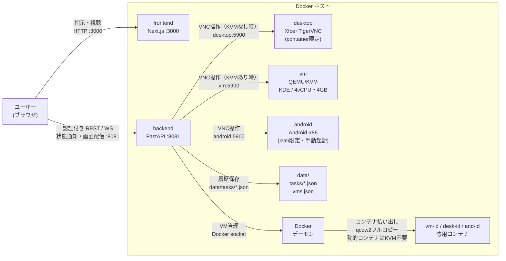
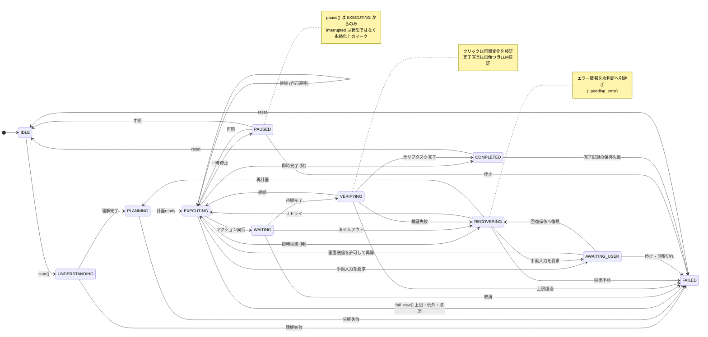
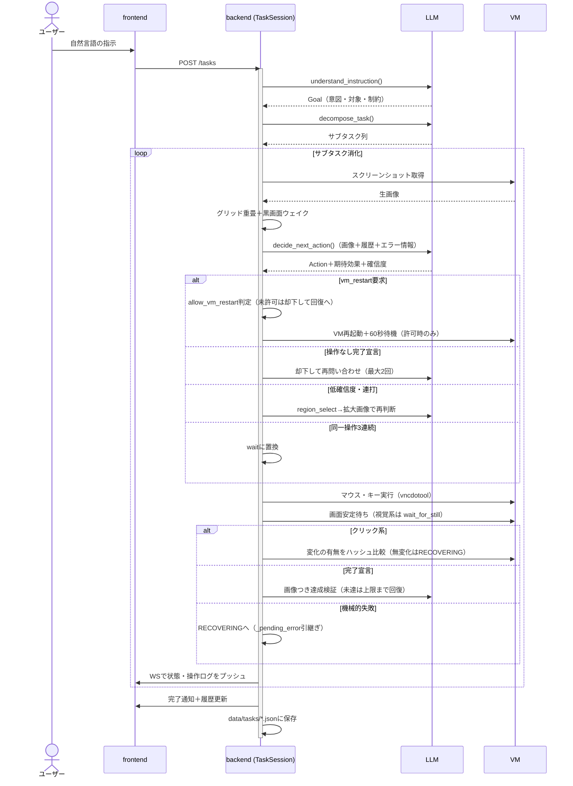
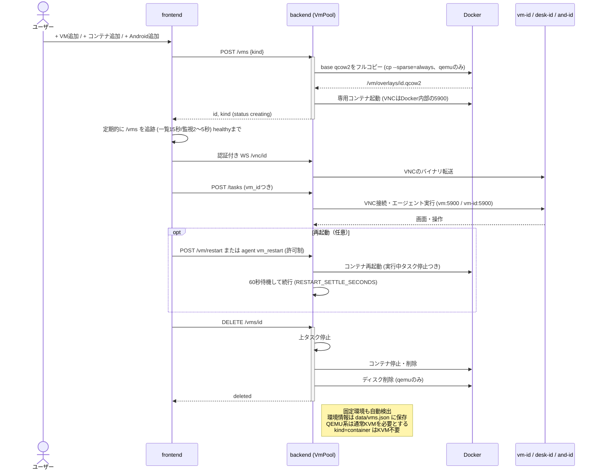

# アーキテクチャ詳細設計

本書は実装の実態に合わせた設計書である。コードを読む際の地図として使う。主要モジュールはsrc/ai_desktop_agent/配下のserverとagentとactionsとvm、frontend/src/、vm/のゲストコンテナ定義とする。

## 目次

1. [システム概要](#システム概要)
2. [バックエンド](#バックエンド)
3. [状態機械と実行フロー](#状態機械と実行フロー)
4. [意思決定層](#意思決定層)
5. [観測](#観測)
6. [アクション実行](#アクション実行)
7. [VM操作](#vm操作)
8. [フロントエンド](#フロントエンド)
9. [安全性](#安全性)
10. [制限と今後](#制限と今後)
11. [図の管理](#図の管理)

図は本文中のMermaidブロックで管理する。別ファイルや画像生成は不要とする。GitHubとVS CodeのMarkdownプレビューでそのまま表示できる。

## システム概要

自然言語の指示で仮想マシンのGUIをAIが直接操作する。利用者はブラウザから指示を出し、AIがVMを操作する様子をnoVNCビューアで見ることができる。


```mermaid
flowchart LR
    user["ユーザー<br/>(ブラウザ)"]
    subgraph host["Docker ホスト"]
        direction LR
        fe["frontend<br/>Next.js :3000"]
        be["backend<br/>FastAPI :8081"]
        desk["desktop<br/>Xfce+TigerVNC<br/>(container限定)"]
        vm["vm<br/>QEMU/KVM<br/>KDE / 4vCPU・4GB"]
        and["android<br/>Android-x86<br/>(kvm限定・手動起動)"]
        vm2["vm-id / desk-id / and-id<br/>専用コンテナ"]
        data["data/<br/>tasks/*.json<br/>vms.json"]
        docker["Docker<br/>デーモン"]
    end
    user -->|指示・視聴<br/>HTTP :3000| fe
    user -->|認証付き REST / WS<br/>状態通知・画面配信 :8081| be
    be -->|VNC操作（KVMなし時）<br/>desktop:5900| desk
    be -->|VNC操作（KVMあり時）<br/>vm:5900| vm
    be -->|VNC操作<br/>android:5900| and
    be -->|履歴保存<br/>data/tasks/*.json| data
    be -->|VM管理<br/>Docker socket| docker
    docker -->|コンテナ払い出し<br/>qcow2フルコピー<br/>動的コンテナはKVM不要| vm2
```

| 名称 | 中身 | ホスト公開ポート | 役割 |
|---|---|---|---|
| frontend | Next.js | 3000 | チャットUIとnoVNCビューアとVM管理 |
| backend | FastAPI | 8081 | 認証、API、状態通知、VNC転送、エージェント実行、履歴保存 |
| desktop | XfceとTigerVNC | なし | containerプロファイルの作業環境 |
| vm | QEMUとKVM | なし | KDEの作業環境。kvmプロファイルに属する |
| android | Android-x86とQEMU | なし | kvmプロファイルの手動起動。VNC操作は通常VMと同じ |

動的環境は台数分の専用コンテナを使い、ホストのポートを払い出さない。QEMU系はkvmプロファイル、desktop系はcontainerプロファイルに属する。up.shはx86_64、/dev/kvm、ゲストファイルが揃う場合にvm系、それ以外はdesktop系を起動する。初期起動の作業環境は1つで、androidは含まない。USE_KVM=falseはdesktopを選び、trueで条件が不足すれば起動前に止まる。

| 送信元 | 送信先 | 経路 |
|---|---|---|
| ブラウザ | backendのAPIとWS | ホストの:8081 |
| ブラウザ | 画面配信 | :8081/vnc/{id}。認証後にバックエンドがVNCへ転送する |
| backend | desktopのVNC | desktop:5900。KVMなし時でDocker内部ネットワーク |
| backend | VMのVNC | vm:5900。KVM時で動的VMはvm-ID:5900 |
| backend | AndroidのVNC | android:5900。動的はand-ID:5900 |
| backend | AndroidのADB | Docker内部の名前:5555 |
| backend | Docker | /var/run/docker.sock。VM作成と再起動用 |

LLM_PROVIDER、LLM_MODEL、各種APIキーでLLMを設定する。USE_KVMの既定値はauto、ALLOW_TCG_VMはfalse、VM_MEMORYは4096、VM_CPUSは4、DATA_DIRは./dataとなる。up.shはComposeが解決したUSE_KVMを読み、接続先と判定結果をバックエンドにも渡す。VNC_HOSTの既定はComposeではdesktop、バックエンド単体ではlocalhostとなる。VM_MEMORYとVM_CPUSの固定値はComposeで定め、動的払い出しでは環境変数を使う。

### ネットワーク

管理用のdefaultネットワークにはフロントエンドとバックエンドを置く。各作業環境はproject_env_IDという名前の専用bridgeを使い、バックエンドだけが各bridgeにも接続する。固定環境のbridgeはCompose、動的環境はEnvironmentNetworksが作る。新しい作業環境にはNET_RAWを与えない。

コンテナの起動点はserver/__main__.pyとなる。管理用IPとサブネットをDockerから確認し、そのIPだけでAPIを待ち受ける。ManagementNetworkMiddlewareも実際の送信元IPを確認し、管理用ネットワーク以外を拒否する。転送ヘッダーは信頼しない。管理経路のgw_priorityは1、専用bridgeは0とし、追加接続で既定経路を変えない。Docker API 1.48以降とCompose 2.33.1以降を必要とする。

起動時、環境一覧の取得時、タスク投入時に所属と専用ネットワークを確認する。旧環境は新しい接続先を確保してから共有ネットワークを外す。保存済みのisolated_networkは、旧環境の発見とバックエンド再作成後の再接続にも使う。移行失敗では処理を止め、別プロジェクトや未知のコンテナを切断しない。専用bridgeは環境削除時に回収する。

## バックエンド

src/ai_desktop_agent/server/app.pyがAPIとWebSocketを提供する。

### 認証

server/auth.pyが接続キーとブラウザセッションを管理する。AGENT_ACCESS_TOKENがなければdata/auth/access-keyを0600で生成する。POST /auth/loginでキーを照合し、12時間有効のHttpOnly・SameSite=Strict Cookieを発行する。HTTPSではSecureも付ける。ブラウザの保存領域やURLにはキーを残さない。

GET /auth/statusとGET /health、POST /auth/login以外は認証を必須とする。APIクライアントはAuthorization: Bearerを使える。POST /auth/logoutと期限切れでセッションを失効させ、開いているWebSocketも閉じる。セッションはメモリ内で管理し、バックエンド再起動後は再ログインする。利用者ごとの権限分離は未対応となる。

画面配信は/vnc/{id}から所属プロジェクトの環境へ接続する。接続先はVM情報から決め、任意のホストやポートを受け付けない。バイナリ転送にはサイズと送信待ち時間の上限を設け、切断時にTCP接続も閉じる。

### エンドポイント

| 方法 | パス | 用途 |
|---|---|---|
| GET | /health | 生存確認 |
| POST | /tasks | タスク投入。instructionとvm_idとallow_vm_restartを指定できる |
| GET | /tasks | 履歴一覧。新しい順に返す |
| GET | /tasks/{id} | タスク詳細。操作履歴と推論を含む |
| DELETE | /tasks/{id} | 履歴削除。実行中なら止めてから消す |
| GET | /tasks/current | 最新タスク状態。vm_idで環境を選べる |
| POST | /tasks/current/{pause,resume,stop} | タスク制御 |
| GET | /vms | VM一覧 |
| POST | /vms | VM作成。ディスク複製と起動を行う |
| DELETE | /vms/{id} | VM削除。上のタスク停止とコンテナ削除を行い、動的はディスクも消す |
| POST | /vms/{id}/stop | VMとコンテナの停止。固定と動的に使え、上のタスク停止と中継連動を含む |
| POST | /vms/{id}/start | VMとコンテナの起動。固定と動的に使え、中継連動を含む。QEMU系はKVM必須 |
| GET | /vm/status | 既定VMの状態。DockerとQMPで確認する |
| POST | /vm/restart | 既定VMの再起動。そのVMの実行中タスクを停止する |
| WS | /ws | 状態と操作ログの配信 |

### セッション管理

1タスクは1つのTaskSessionに対応し、_sessionsで管理する。_active_sessionは後方互換のための最新1件とする。vm_id省略時は稼働中のdesktopを優先する。WebSocketは接続時に全環境のsnapshotを送り、その後state・action・error・completeを送る。イベントにはsession_idとvm_id、状態更新にはrevisionも付ける。フロントは古いrevisionを適用しない。接続ごとの送信キューを使い、遅い閲覧者からタスクの実行を切り離す。

request_user_inputはTaskSessionで処理し、awaiting_userの間は画面取得とモデル呼び出しを止める。状態通知とsnapshotにmanual_inputのid・reasonを付ける。POST /tasks/current/resumeはmanual_input_idとallow_screen_share=trueが一致する場合だけ再開する。入力値は受け取らない。同じ環境へのタスク投入も待機中は拒否する。

### 実行制限

agent/budget.pyが実行制限を管理する。起動時に環境変数を検証し、TaskSession.runでタスクごとのContextVarを設定する。モデルへのHTTP送信前と使用量の受信時、画面操作前に上限を確認する。再試行と決定モデルも同じ予算を使う。OpenAI SDKの自動再試行は無効にし、送信ごとに回数を数える。

期限切れではディスプレイに停止を要求してからタスクを取り消し、実行中のスレッドを待って接続を解放する。上限の例外はLLMへの退避やエラー回復に変換しない。execution_limits・execution_usage・stop_reason・error_messageをTaskRecordに保存し、履歴の取得後も停止理由と使用量を表示する。推定費用は設定単価で算出し、請求額とは区別する。

### 永続化

data/tasks/タスクID.jsonに1タスク1ファイルで保存し、状態遷移とアクション実行のたびに更新する。TaskRecordは指示、状態、成否、操作履歴、判断理由、確信度、サブタスク、進捗index、vm_id、Goal、トークンと呼出回数を持つ。決定モデルのdecision_callsとdecision_escalationsも記録する。起動時は全件を確認し、実行中だった記録をinterruptedに変える。

server/persistence.pyが一時ファイルのfsync、os.replace、親ディレクトリのfsyncで保存する。新規ファイルは0600とする。保存先に書き込めなければ起動・タスク投入を止め、実行中の保存失敗でも以後の操作を打ち切る。保存できない場合も画面には失敗を通知する。

### KVM判定

server/kvm.pyはUSE_KVM明示値、バックエンドの/dev/kvm、Dockerの順に判定する。Dockerでは同じComposeプロジェクトのvmに/dev/kvmが割り当てられていることを確認する。停止後の起動にも使うため稼働状態は問わず、ホストのデバイス消失はDockerの起動エラーとなる。KVMなしでのQEMU系の作成・起動・再起動はAPI 409で拒否し、ALLOW_TCG_VM=trueでのみTCGを許可する。

### VM制御

server/vm_control.pyのVmControllerが既定VMの状態取得と再起動を担う。状態にQMPのquery-status結果をqmp_statusとして添える。Docker不通時はDockerUnavailableErrorとして503を返す。

### VMプール

server/vm_pool.pyのVmPoolが環境の一覧・作成・起動・停止・再起動・削除を担う。固定desktopはid=desktop、managed=Falseで検出する。default_vmは稼働中のdesktopを優先し、なければ稼働中の先頭を返す。

POST /vmsのkindはqemuが既定で、containerとandroidも選べる。各環境は専用コンテナで動く。QEMU系は通常KVMを必要とし、TCGの明示許可時は/dev/kvmを要求しない。containerはKVM不要となる。動的IDの接頭辞はvm、desk、andで、その後に16進数を付ける。動的環境は全種別の合計で8台までとする。

環境情報はdata/vms.jsonに保存し、kindは一覧にも返す。旧APIのvnc_port・ws_port・adb_portは0を返し、画面接続には/vnc/{id}を使う。固定vm・desktop・androidもDELETE /vmsで削除できる。ホストパスはバックエンド自身の/app/dataマウント元から逆算する。

## 状態機械と実行フロー

### 状態と遷移

有限状態機械とする。agent/state.pyとagent/loop.pyで定義し、AgentLoopが有効遷移のみを通す。不正遷移はInvalidTransitionErrorとする。有効遷移の基準は_VALID_TRANSITIONSでagent/state.py:29に置く。


```mermaid
stateDiagram-v2
    direction LR
    [*] --> IDLE
    IDLE --> UNDERSTANDING : start()
    UNDERSTANDING --> PLANNING : 理解完了
    UNDERSTANDING --> FAILED : 理解失敗
    PLANNING --> EXECUTING : 計画ready
    PLANNING --> FAILED : 分解失敗
    EXECUTING --> WAITING : アクション実行
    EXECUTING --> EXECUTING : 継続 (自己遷移)
    EXECUTING --> PAUSED : 一時停止
    EXECUTING --> AWAITING_USER : 手動入力を要求
    EXECUTING --> FAILED : fail_now() 上限・例外・取消
    EXECUTING --> RECOVERING : 即時回復 (稀)
    EXECUTING --> COMPLETED : 即時完了 (稀)
    WAITING --> VERIFYING : 待機完了
    WAITING --> RECOVERING : タイムアウト
    WAITING --> FAILED : 取消
    VERIFYING --> EXECUTING : 継続
    VERIFYING --> COMPLETED : 全サブタスク完了
    VERIFYING --> RECOVERING : 検証失敗
    VERIFYING --> FAILED : 上限超過
    RECOVERING --> EXECUTING : リトライ
    RECOVERING --> PLANNING : 再計画
    RECOVERING --> FAILED : 回復不能
    RECOVERING --> AWAITING_USER : 手動入力を要求
    AWAITING_USER --> EXECUTING : 画面送信を許可して再開
    AWAITING_USER --> RECOVERING : 回復操作へ復帰
    AWAITING_USER --> FAILED : 停止・期限切れ
    PAUSED --> EXECUTING : 再開
    PAUSED --> IDLE : 中断
    PAUSED --> FAILED : 停止
    COMPLETED --> IDLE : reset
    COMPLETED --> FAILED : 完了記録の保存失敗
    FAILED --> IDLE : reset

    note right of VERIFYING
        クリックは画面変化を検証
        完了宣言は画像つきLLM検証
    end note

    note right of RECOVERING
        エラー情報を次判断へ引継ぎ
        (_pending_error)
    end note

    note right of PAUSED
        pause() は EXECUTING からのみ
        interrupted は状態ではなく
        永続化上のマーク
    end note
```

interruptedはバックエンド再起動後の永続化上の目印で、状態機械の状態ではない。pauseはEXECUTINGから行う。手動入力を終えると要求前のEXECUTINGかRECOVERINGへ戻る。上限超過・例外・取消ではFAILEDに移る。一時停止中と手動入力中の停止もFAILEDとして保存し、完了を通知する。

### 実行フロー

TaskSessionの実行順序はserver/session.py:runに置く。


```mermaid
sequenceDiagram
    actor U as ユーザー
    participant FE as frontend
    participant BE as backend (TaskSession)
    participant LLM as LLM
    participant VM as VM
    U->>FE: 自然言語の指示
    FE->>BE: POST /tasks
    activate BE
    BE->>LLM: understand_instruction()
    LLM-->>BE: Goal（意図・対象・制約）
    BE->>LLM: decompose_task()
    LLM-->>BE: サブタスク列
    loop サブタスク消化
        BE->>VM: スクリーンショット取得
        VM-->>BE: 生画像
        BE->>BE: グリッド重畳＋黒画面ウェイク
        BE->>LLM: decide_next_action()（画像＋履歴＋エラー情報）
        LLM-->>BE: Action＋期待効果＋確信度
        alt vm_restart要求
            BE->>BE: allow_vm_restart判定（未許可は却下して回復へ）
            BE->>VM: VM再起動＋60秒待機（許可時のみ）
        else 操作なし完了宣言
            BE->>LLM: 却下して再問い合わせ（最大2回）
        else 低確信度・連打
            BE->>LLM: region_select→拡大画像で再判断
        else 同一操作3連続
            BE->>BE: waitに置換
        end
        BE->>VM: マウス・キー実行（vncdotool）
        BE->>VM: 画面安定待ち（視覚系は wait_for_still）
        alt クリック系
            BE->>VM: 変化の有無をハッシュ比較（無変化はRECOVERING）
        else 完了宣言
            BE->>LLM: 画像つき達成検証（未達は上限まで回復）
        else 機械的失敗
            BE->>BE: RECOVERINGへ（_pending_error引継ぎ）
        end
        BE->>FE: WSで状態・操作ログをプッシュ
    end
    BE->>FE: 完了通知＋履歴更新
    BE->>BE: data/tasks/*.jsonに保存
    deactivate BE
```

処理は次の順序で進む。まずUNDERSTANDINGでunderstand_instructionにより指示をGoalに変える。Goalは意図と対象アプリと制約とする。失敗時は専用遷移を呼ばず、汎用例外処理でFAILED化する。次にPLANNINGでdecompose_taskによりサブタスク列に分ける。サブタスクはIDと説明と期待結果を持つ。続いてEXECUTINGからWAITINGを経てVERIFYINGに戻る循環に入る。_execute_phaseが担う。画面取得では重畳付き画像を使う。真っ黒ならShiftキーを送って復帰させ、再取得する。前回と同一画面なら無変化の旨をLLMに渡す。操作なし完了宣言は最大2回まで却下して問い直す。MAX_EMPTY_COMPLETE_REFUSALSと_is_empty_completeで判定する。低確信度クリックと同一座標連打はregion_select拡大フローへ回す。同一アクション3連続はwaitに置き換える。足踏みを止めるためである。vm_restartは専用フローで処理する。座標は画面内に収めてから実行する。視覚系操作後は画面安定待ちを行う。wait_for_stillを使う。ステップ上限200を超えるとfail_nowで打ち切る。MAX_ACTIONS_PER_TASKで定める。

VERIFYINGでは_verify_phaseが機械的失敗をRECOVERINGへ回す。エラー情報は次判断へ引き継ぐ。クリック系は画面変化の有無をハッシュ比較する。無変化は空振りとしてRECOVERINGへ回す。subtask_completeは期待結果の達成を画像付きでLLM検証する。_verify_subtask_phaseで行う。未達は上限まで回復し、超過でfail_nowとする。上限はmax_retriesで定める。

RECOVERINGでは最新のエラーから回復計画を作る。回復操作を実行して記録し、理由を次の判断へ渡す。再計画では完了済みのサブタスクを残して残作業を分解する。再試行はmax_retries、再計画はタスク内3回、全操作は200回までとする。回復中のVM再起動にも許可確認を適用する。

### VM再起動

vm_restartはallow_vm_restartが真の場合だけ実行する。未許可なら却下して回復フローへ戻る。ディスクの初期化は行わず、再起動後はRESTART_SETTLE_SECONDSの60秒待ってから画面を確認する。

## 意思決定層

判断は生成系LLMと決定モデルの分担を方針とする。生成の座標と文章と計画はLLM、定型判断の成否と戦略選択は決定モデルに寄せる。

### LLMプロバイダ

agent/llm配下に置く。factory.pyのcreate_llm_providerが全提供元をOpenAICompatProviderに束ねる。対応はopenaiとanthropicとopenrouterとopencodeのZen、opencode-goのGo、ollama、mockとする。既定モデル例はgpt-4oとdeepseek-v4.1-flashとする。LLM_PROVIDERとLLM_MODELと各種APIキーで切り替える。

openai_compat_provider.pyの仕様は次の通りとする。画像は同一解像度JPEGのq80とdetail highで送る。座標系を保ちつつ軽くするためである。出力形式はStructured Outputのresponse_format json_schemaで強制する。非対応モデルでは通常JSONモードへ自動切替する。_structured_output退避で行う。不正な引数は_sanitize_paramsで整え、画面内収めは_clamp_paramsで行う。必須項目の欠落はActionの検証で誤りとする。OpenCode系にはUser-Agentのai-desktop-agent/0.1.0を付け、タスクIDをx-opencode-sessionで送る。session_idに対応する。呼出ごとのトークン使用量は_record_usageで累積し、タスク記録に保存する。max_tokensは1500に絞る。出力は小さいJSONのみのためである。

システムプロンプト方針は座標グリッドの読み方、2段階クリック、アプリ起動はキーボード優先、不足アプリは端末で導入、subtask_completeは操作後のみとする。画面文字はLLMが画像から直接読む。

### 決定モデルの組込

実装済みとする。agent/decisionに置き、受け付ける型はnoulの成否とchoiceの戦略選択とscoreの評価の3型とする。System One互換APIで受け、提供元はDECISION_PROVIDERで切り替える。noneは従来動作で既定とし、mockは外部通信なしの簡易判定、clefはWorkers AI直結のClefとclef-flash、clef-openrouterはOpenRouter Decisions API経由のClef系を使う。clef-openrouterのみLLM本体と別のAPIキー（CLEF_API_KEY優先、なければOPENROUTER_API_KEY）を使える。既定モデルはclef-flashとする。中間帯と失敗時はLLMに退避するため、誤判定より退避を優先する。利用実績はdecision_callsとdecision_escalationsで記録する。

| 番号 | 組込点 | 置換対象 | 期待効果 |
|---|---|---|---|
| 1 | 回復戦略の選択 | _recover_phaseのLLM呼出 | 数百msで戦略確定。文章生成が不要な分類に適する |
| 2 | サブタスク達成検証 | _verify_subtask_phaseの画像付きLLM検証 | 高確信で前進し、低確信で回復し、中間でLLM検証へ回す。確率閾値で設計する |
| 3 | 評価ハーネス | なし。新設済み | 保存済みタスク記録を正解集団とし、精度と分布を測る。agent/decision/eval.pyとscripts/eval_clef.pyを使う。推奨順序はClef-flashからClefとする |

置換しないものはdecide_next_actionの座標とJSON生成、タスク分解、画面文字の読解とする。判断は決定モデル、実行内容の生成はLLMの分担を保つ。ベンチマークは提供元申告のため、自タスクでの精度と待ち時間と単価で選ぶ。利用可否の検討内容はdocs/research/clef.mdに残す。

## 観測

LLMに渡すのは生画像ではない。座標ヒントを重ねた画像と文字情報とする。

画面取得の値オブジェクトはvm/screenshot.pyに置く。with_overlayとcrop_with_metaを持つ。重畳描画はvm/overlay.pyに置く。50pxグリッドと100pxごとの太線、上端と左端の座標数字、カーソル十字、外周枠を描く。文字は12ptとする。ズーム画像には25pxグリッドを使う。領域ズームはcrop_region_with_metaで行い、2倍拡大画像と実倍率を返す。逆変換はabsolute = origin + zoomed_coord / actual_scaleで行う。_handle_region_zoomが担う。入れ子は深さ1までとする。

画面文字の読解はLLMが画像から直接行う。OCR機構（vm/ocr.py・WAIT_FOR_TEXT）は実画面ABで有益信号がなく削除した。

カーソル情報はVNCClientのcursor_positionとhas_custom_cursorを使う。cursor_positionは通信層の値を優先し、取れなければ内部追跡値を返す。重畳の十字には内部追跡の_cursor_xと_cursor_yを直接使う。

照合はvm/matcher.pyに置く。PILのみの正規化相互相関とし、単色はSAD併用、粗密2段階とする。executor.locateから利用できる。テンプレート供給元は今後の課題とする。

黒画面ウェイクはDPMS消灯などで全面真っ黒を検出したら起こして再取得する。平均輝度2.0未満を黒とみなし、最大1回まで行う。_is_black_screenで判定する。Linux系はShiftキーを送る。Android端末のandroidとand始まりは公式手順に沿い、ESCからMenuの1秒超保持と中央タップを行う。VNCClient.wake_androidが担う。実機の深い休止では戻らない場合がある。このためAndroidの休止対策は初期設定での無効化を本命とする。内容は休止最大と起床状態維持ONと画面保護無効とし、ADBのshell命令のみで行う。画面施錠の無効化命令は含まない。VNCタップ列は使わない。到達不能時は警告記録に留め、次回に再試行する。

無変化検出は前回のハッシュ比較で行い、画面が変わっていない旨を次判断に伝える。

## アクション実行

定義はactions/primitives.pyに置く。マウス7種とキー4種と待機3種、内部用のscreenshot、region_select、subtask_complete、vm_restartを持つ。クリック系は座標必須とする。allowed_paramsとrequired_paramsで検証する。

実行はactions/executor.pyに置き、Actionをbackend操作に変える。REGION_SELECTとVM_RESTARTはセッション側で処理する。このため実行器に届いた場合は警告のみ出す。REQUEST_USER_INPUTもセッションで処理し、実行器に届けば失敗とする。安定待ちのwait_for_stillを持つ。

VNC実装はvm/vnc_client.pyに置き、vncdotoolを包む。接続時はRFBの初期化まで待つ。vm/vnc_transport.pyのManagedVNCProxyは操作を直列化し、操作ごとのFutureで結果を返す。応答待ちの上限は10秒とし、期限切れや切断では待機中の操作と接続処理を取り消してTCP接続を閉じる。無効な入力のエラーやNoneの戻り値も、次の操作の結果に影響させない。

ASCIIのtype_textは1文字ずつキーイベントを送る。Shiftが必要な文字はShift修飾を使わず文字自体のX11 keysymを直接送る。Shift修飾はVNC経路で外れる実測があるためである。大文字AからZはそのまま通す。vncdotoolのKEYMAPに無い名前のbackspaceなどは起動時に補う。ドラッグはmouseMoveを段階的に送り、途中で停止要求を確認する。クリックは移動と整定待ち、50ms押下、解放の順に行う。ダブルクリックは同座標明示とする。組合せキーは20ms間隔とする。座標は画面内に収める。

Unicode入力はvm/clipboard.pyで[RFB Extended Clipboard](https://github.com/rfbproto/rfbproto/blob/master/rfbproto.rst#extended-clipboard-pseudo-encoding)を実装する。サーバーの対応を確認し、NotifyとShift+Insertで貼り付け、要求された入力文字列だけをUTF-8のProvideで返す。入力は64 KiB、受信メッセージは1 MiB、応答待ちは2秒を上限とし、待機中も停止を確認する。既存のクリップボードの取得要求と受信データの展開は行わない。QEMU・AndroidのUnicode入力は未対応となる。

## VM操作

### 実行環境の3種

desktopはdesktop配下に置き、XfceとTigerVNCをcontainerプロファイルで動かす。QEMUは不要となる。VNCはDocker内部のdesktop:5900で使い、画面配信は認証付きプロキシを通す。解像度は1280x800でVNC_GEOMETRYが指定する。FirefoxとLibreOfficeのWriterとCalc、xdotool、wmctrlを同梱する。LANG=C.UTF-8を既定とし、動的コンテナにも指定する。

vmはvm配下に置き、QEMUとKVMでKDEを動かす。kvmプロファイルに属し、起動条件と選択は構成の節に従う。up.shがバックエンドの接続先も切り替える。VmPool.default_vmはdesktop稼働時にはdesktopを優先する。

androidはAndroid-x86をQEMUで動かし、動的払い出しとandroidサービスで提供する。QEMUとKVM上でAndroid-x86のISOをLive起動する。VNC操作は通常VMと同一のため、VNCClientをそのまま使う。タップはクリック、スワイプはドラッグに対応付ける。KVM必須でkvmプロファイル配下とする。ISOはandroid/android-x86_64.isoに配置する。容量のためgit管理外とし、手順はandroid/README.mdに置く。休止しない設定は初回配備で入れる。AndroidProvisionerとandroid_adbで行う。内容は休止最大と起床状態維持ONと画面保護無効とする。ADBのshell命令のみとし、画面施錠の無効化命令は含まない。VNCタップ列は使わない。seed同梱なしで空dataから設定し、定期的なキー送信はしない。到達不能時は警告記録に留め、次回に再試行する。QEMUのADB転送のhostfwdは既定ONとする。詳細はandroid/README.mdに置く。

### KVM自動切替と起動制限

USE_KVMは未設定時にautoとする。起動前にゲスト4ファイルを確認し、Composeのマウントも存在しないファイルを自動作成しない。QEMUのentrypointも必要なファイルを確認する。TCGはALLOW_TCG_VM=trueでのみ許可する。エージェントのvm_restartが制限環境で要求された場合は失敗として_pending_errorに渡し、別手段での継続を促す。

VmPoolはDocker経由で専用コンテナを払い出す。新しい環境に公開ポートや中継は作らない。起動時に同じプロジェクトの旧中継を撤去し、失敗した場合はバックエンドの起動を止める。既存環境のVNC公開設定は再作成するまで残る。QEMU VMは通常KVMを必要とし、コンテナは不要となる。


```mermaid
sequenceDiagram
    actor U as ユーザー
    participant FE as frontend
    participant POOL as backend (VmPool)
    participant DOCKER as Docker
    participant VM as vm-id / desk-id / and-id
    U->>FE: + VM追加 / + コンテナ追加 / + Android追加
    FE->>POOL: POST /vms {kind}
    activate POOL
    POOL->>DOCKER: base qcow2をフルコピー (cp --sparse=always、qemuのみ)
    DOCKER-->>POOL: /vm/overlays/id.qcow2
    POOL->>DOCKER: 専用コンテナ起動 (VNCはDocker内部の5900)
    POOL-->>FE: id, kind (status creating)
    deactivate POOL
    FE->>FE: 定期的に /vms を追跡 (一覧15秒/監視2〜5秒) healthyまで
    FE->>POOL: 認証付き WS /vnc/id
    POOL->>VM: VNCのバイナリ転送
    FE->>POOL: POST /tasks (vm_idつき)
    POOL->>VM: VNC接続・エージェント実行 (vm:5900 / vm-id:5900)
    VM-->>POOL: 画面・操作
    opt 再起動（任意）
        FE->>POOL: POST /vm/restart または agent vm_restart (許可制)
        POOL->>DOCKER: コンテナ再起動 (実行中タスク停止つき)
        POOL->>POOL: 60秒待機して続行 (RESTART_SETTLE_SECONDS)
    end
    FE->>POOL: DELETE /vms/id
    activate POOL
    POOL->>POOL: 上タスク停止
    POOL->>DOCKER: コンテナ停止・削除
    POOL->>DOCKER: ディスク削除 (qemuのみ)
    POOL-->>FE: deleted
    deactivate POOL
    Note right of POOL: 固定環境も自動検出<br/>環境情報は data/vms.json に保存<br/>QEMU系は通常KVMを必要とする<br/>kind=container はKVM不要
```

### QEMU起動構成

vm/entrypoint.shに置く。

```text
qemu-system-x86_64 -enable-kvm -cpu host -smp $VM_CPUS -m $VM_MEMORY
  -kernel /vm/vmlinuz -initrd /vm/initrd.img -append "$CMDLINE"
  -drive file=$VM_IMAGE,if=virtio,format=qcow2
  -vnc 0.0.0.0:$VNC_DISPLAY -device virtio-net,netdev=net0 -netdev user,id=net0
  -serial stdio -display none
  -chardev socket,path=$QMP_SOCK,... -mon chardev=...,mode=control
  -chardev socket,... -device virtio-serial-pci -device virtserialport,...,name=org.qemu.guest_agent.0
```

KVMとhost CPU、4vCPUと4GBを既定とする。固定値はcomposeで定める。マシン型は変えない。NIC名のens3がnetplanに固定のためである。USE_KVM=auto時は/dev/kvmの有無でKVMとTCGを自動選択する。TCG側は既定で起動拒否し、ALLOW_TCG_VM=trueでのみ許可する。許可時のTCGは-cpu qemu64と-smp 1に切り替わる。保存はvirtio、通信はslirpのuser-mode NAT、VNC直結、シリアルは起動記録用とする。QMPとguest-agent用ソケットは/vm/sockets/配下とし、QMP_SOCKとQGA_SOCK環境変数でVMごとに変えられる。

### ゲスト画像構築

vm/build-vm-image.shで行う。debootstrapでUbuntu 24.04とKDE PlasmaとSDDMを構築し、qcow2化する。再構築時の必須項目は次の通りとする。利用者agentのNOPASSWD sudo、SDDM自動ログインでセッション自動検出、画面施錠無効と電源管理の休止と画面OFF無効、ログイン時DPMS無効化のdisable-dpms.desktopでXのDPMS 600秒消灯が残るため、netplanでens3をDHCP化でNetworkManager単独ではunmanagedになるため、/etc/resolv.confをQEMU内蔵DNSの10.0.2.3直書きと/etc/hostsに自ホスト名、ディスク下限15GBでKDEとsnap導入で3から4GBでは枯渇するため、qemu-guest-agentとxdotoolとwmctrlを同梱とする。注意点としてUbuntu 24.04のfirefoxパッケージはsnap移行置物である。エージェントがsudo snap install firefoxで導入する運用とし、通信が必要である。

### ゲスト内通信

QEMU slirpは10.0.2.0/24、入口は.2、DNSは.3とする。過去のつまずきはNIC DOWN、NM unmanaged、resolv.confのstub迷子、ディスク枯渇とする。いずれも上記設定で解消済みとする。再発時はip -brief addrとgetent hostsから切り分ける。

### 保存方式

固定desktopと新しい動的コンテナはproject_home_IDという専用ボリュームに/home/agentを保存する。WorkspaceVolumesは所属・用途・localドライバーを照合し、動的環境の削除時だけボリュームも回収する。旧版の動的コンテナは更新で再作成せず、ホームの自動移行もしない。

scripts/up.shはビルド後、workspace_migrationの別コンテナで更新ロックを取得する。通常のバックエンドと選択した固定環境を止め、固定desktopのホームを退避する。HomeBackupsは0600のtarとSHA-256付き情報を保存し、通常ファイル・ディレクトリ・リンクを検査する。旧ホームはネットワークのない専用コンテナでボリュームへ展開し、ルートの所有者とモードも復元して読み戻す。照合後にComposeで再作成し、完了までロックを保持する。失敗時は残っている元のコンテナの再開を試み、バックアップを残す。旧版の専用bridgeは既知の接続先を停止してからCompose用ラベルも補う。

vm/desktop.qcow2は読み取り専用テンプレートとする。固定VMは初回だけvm/instances/default.qcow2へ複製し、再起動で上書きしない。動的VMはvm/overlaysへ独立したコピーを作る。動的ディスクはバックエンドの/vm/overlaysにも共有マウントし、コンテナの削除成功後に削除する。固定VMの削除では専用ディスクを残す。

data/vms.jsonはファイルロックで同時更新を保護し、原子的に保存する。破損した情報は上書きせずエラーを返す。作成前に割当情報を保存し、作成失敗時はその環境のコンテナとディスクの回収を試みる。

### 監視と管理

ヘルス確認はVNCポート疎通でComposeが行う。QMPのvm/qmp.pyはquery-statusなどを行い、/vm/statusのqmp_statusに反映する。guest agentのvm/qga.pyはguest-ping、get-osinfo、guest-execを提供し、診断と検証に使う。画面配信はserver/vnc_proxy.pyが担い、ブラウザはVncViewer.tsxのnoVNCで表示する。VmControllerは既定VMの状態と再起動、VmPoolは各環境の管理を担う。

## フロントエンド

Next.jsのApp Routerを使う。InstructionInputで指示と再起動許可を受け、StatusPanelとLogPanelで進捗を示す。VmTabsで環境を選ぶ。VncViewerは選択した稼働中の環境だけに接続し、切断時にRFBを作り直す。入力の送信失敗時は指示を残し、日本語変換中のEnterでは送信しない。

デバッグ系はCollapsibleSectionで折り畳む。側面幅は280から720pxで変更し、localStorageに保存する。状態・ログ・進捗はVM単位で保つ。WebSocketはpingで疎通を確認し、再接続時にsnapshotで状態を同期する。履歴の操作記録はGET /tasks/{id}で取得する。

## 安全性

安全性と未実装の対策は[safety.md](safety.md)にまとめる。バックエンドはDockerソケットを使うため、バックエンド侵害時までホストの隔離を保証する構成ではない。利用者ごとの権限分離と外部公開の検証は未対応とする。

privacy.pyは登録済みのキーをモデルのテキストと保存・配信する記録から除く。ログのメッセージ・例外・最終出力も置き換え、VNCなどのプロトコルのDEBUGログは省く。画像の自動マスキングは行わない。

## 制限と今後

テンプレート照合の供給元のアイコンDBなどが未整備である。決定モデルのClefとSystemOneは実装済みとし、既定は無効とする。意思決定層の表の通り、評価ハーネスで測ってから回復戦略と達成検証の順で有効化する。複数VMのUIはタブ切替と単一ビューアのみとする。同時監視グリッドなどは未対応とする。モデル依存のゆらぎの空応答と非JSONは再試行と代替で吸収しているが、応答の安定したモデル選定が最も効く。

## 図の管理

図は本書のMermaidブロックを基準とする。画像ファイルの生成と管理はしない。状態遷移を変えたらagent/state.pyの_VALID_TRANSITIONSとagent/loop.pyを先に直し、状態機械のMermaidに合わせる。図だけを先に変えないこと。順序を変えたらserver/session.pyとserver/vm_pool.pyとserver/app.pyの順で裏取りする。
